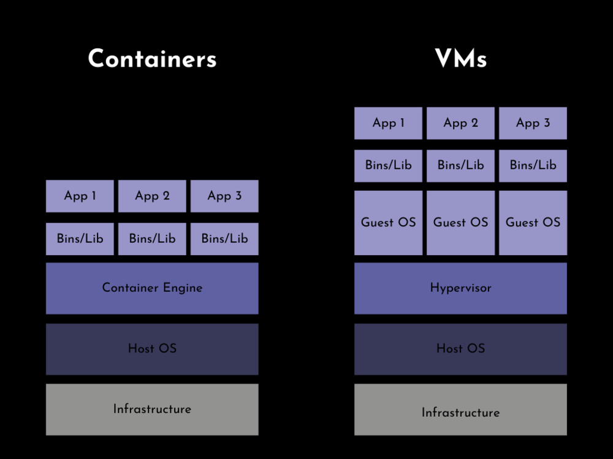

<!--
header: Containers
theme: gaia
class: invert
style: |
  img[alt~="center"] {
    display: block;
    margin: 0 auto;
  }
-->

<!-- _class: lead -->
# Containers

### connecting the things

<!-- _footer: https://github.com/MariaLetta/free-gophers-pac -->

---

## Virtualization

- Hardware abstraction
- Efficiency => 💰
- Tradeoff
  > Nothing in free. Everything has to be paid for.
  > -- Ted Hughes

<!-- graph goes here showing down (complexity) and up (abstraction) -->

---

## Okay, so why Containers?

| Portable, Predictable, Cheap

---

## Portability

- Open Container Initiative (OCI) 
- Spec (Dockerfile) -> Image -> Container

---

## Predictability

- Local "Works on my machine"
- Deploying
- Local -> Development -> QA -> Production

---

## In Practice

- Setup: 5 golang microservices in an event streaming architecture (Kafka, Cassandra)
- `
